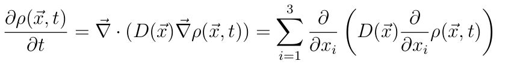
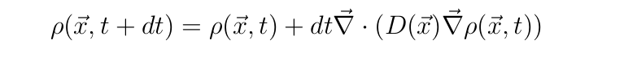
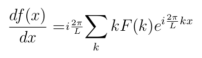
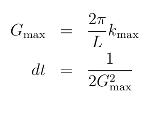
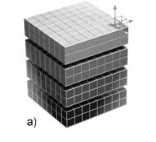

============
D1-exercise1
============

Solving a diffusion equation by means of Fourier Transform
============================================================

The serial code presented in class solves the diffusion equation with space-dependent diffusivity in 3D.
C and FORTRAN implementations are included into the serila_code folder which include interfaces to FFTW library. 
The equation reads:

|diffeq|  

We will handle the time derivative using time-forward finite differences, namely

|finidiff|

so that we can calculate the next steps from the data of the previous step.

For the spatial derivatives, we will use the fact that 
 
|derivative|

where F(k) is the fourier transform of f(x)
So to calculate spatial derivatives, we Fourier transform the function, we multiply by the corresponding k and we back-Fourier transform.

The reason to to this is that the Fourier approach, being a global transformation, is less sensitive to the local details of the solutions, 
hence gives more accurate results. 

A few remarks:

a. For small wavelenght (i.e. large k), the diffusion operator is dominated by a term going like (k*2 pi/L)^2. Therefore, increasing n1,n2,n3 
   at constant L1,L2,L3 increases the highest eigenvalues of the operator. 
   In order to be numerically stable you will have to reduce accordingly the time step dt.  
  
   As a rule of thumb, dt should be smaller than half of the fastest modes in your system. 

   |freq|

b. The FFTW uses the fact that, given an discrete Fourier transform with n frequencies, the frequency k and n-k are the same. Keep
   this is in mind while reading p_derivative.f90. Moreover, the frequency corresponding to n/2 is is set to zero. This is not strctly necessary, 
   but increases the simmetry of the k-values. 
   For example, for n=10
 
   k=0 1 2 3 4 0 -4 -3 -2 -1

c. Remember that, for efficency, FFTW prefers an even number of points, possibly a power of 2.    

Assignment 
============

Parallelize the code, using the interfaces provided within the FFTW library which relies on distributed data among processes.
Apply a data distribution dividing the orginal 3D domain in a 1D decomposition among the outer dimension (see the following picture). 

|1D-decomp|

See FFTW-data-distribution_ for more information.
The following phases of implementation should be excuted:  

  - distribute data structures (diffusivity, conc, dconc, aux1, aux2) accordingly to the data distribution expcted by the FFTW library 
  - modify the code, including calls to the FFTW library, to interface the MPI version of the FFTW
  - handle the correct computation of global quantities 

The template code provided into the folder "provided_code" includes number of HINTs to guide the parallelization.
Remember that the arrays should be just a slice of the global arrays.
Regarding the fftw calls. Here is the substitution: 
     
  - fftw_plan_dft_3d -> fftw_mpi_plan_dft_3d
  - fftw_execute_dft  > fftw_mpi_execute_dft 
  - use fftw_mpi_local_size_3d for local size of the arrays
 
Parallelized version of the I/O subroutines are provided. 

The proposed Makefiles relies on the modulefiles fftw/3.3.4/gnu/4.9.2 and openmpi/1.8.3/gnu/4.9.2 available on Ulisse.
A reserved queue named reserved3 was created for code testing. Verify code efficiency performing a scalability test on 1, 5, 10, 20 processes.  

.. _FFTW-data-distribution: http://www.fftw.org/doc/MPI-Data-Distribution.html#MPI-Data-Distribution 
