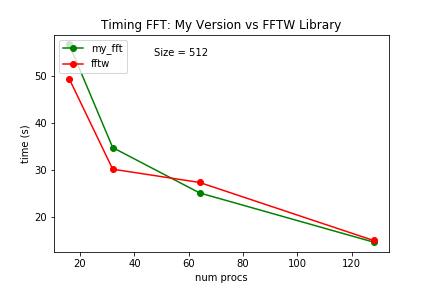

# Short Report

Unfortunatly at the moment, due to a long queue in Ulysses, I was able just to have a complete set of value for the size $512$ from one node up to eight. We were suppose to analyze also sizes $128$ and $2048$ from one node up to sixteen.

In the following plots I report the timing and the scaling obtained comparing the 3D Fast Fourier Transform calculation
with the fftw library and my own versions.
The "my_fft_3d" function contained in the "fft_wrapper.c" computes the
FFT through the calculation of three 1D FFT, one for each dimension.

In the following plots the label "my_fft" refers to data obtained with the "my_fft_3d" function (In folder D2-exercise1/provided_code/myC) while
the label "fftw" refers to data obtained with the fftw library (In folder D1-exercise1/solution/C).

Looking at the results it seems that my implementation is a bit faster than the library. I think that is valid just for this particular problem and and relatively small size ($512^3$). Unfortunately I didn't have time to perform a more detailed analysis.
